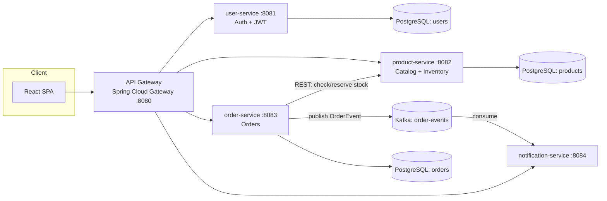

# CloudMart — Event-Driven Microservices E-Commerce Platform

CloudMart is a full-stack e-commerce platform built around independently
deployable Spring Boot microservices that communicate synchronously over
REST and asynchronously over Apache Kafka, fronted by a React SPA and a
Spring Cloud API Gateway.

It's designed to demonstrate the same patterns used in production
enterprise systems: service decomposition, event-driven communication,
JWT-based auth, containerized deployment, and CI.

## Architecture



**Why event-driven?** `order-service` doesn't call `notification-service`
directly. It publishes an `OrderEvent` to Kafka and moves on — this keeps
services decoupled, lets you add new consumers (e.g. analytics, fraud
detection) without touching `order-service`, and means a slow/down
notification pipeline never blocks checkout.

## Services

| Service | Port | Responsibility |
|---|---|---|
| `api-gateway` | 8080 | Single entry point, routes `/api/**` to the right service, CORS |
| `user-service` | 8081 | Registration, login, JWT issuance, BCrypt password hashing |
| `product-service` | 8082 | Product catalog CRUD, stock reservation |
| `order-service` | 8083 | Order placement, calls `product-service` to reserve stock, publishes `OrderEvent` to Kafka |
| `notification-service` | 8084 | Kafka consumer that simulates order-confirmation notifications |
| `frontend` | 3000 | React + Vite SPA: browse products, cart, checkout, order history |

## Tech Stack

- **Backend:** Java 17, Spring Boot 3, Spring Data JPA, Spring Security (JWT), Spring Kafka, Spring Cloud Gateway
- **Frontend:** React 18, React Router, Vite
- **Messaging:** Apache Kafka
- **Data:** PostgreSQL (one schema per service — database-per-service pattern)
- **Infra:** Docker, Docker Compose, GitHub Actions CI
- **Testing:** JUnit 5, Spring Boot Test, Embedded Kafka, AssertJ

## Running locally

### Option A — Docker Compose (recommended)

```bash
docker compose up --build
```

This starts Zookeeper, Kafka, three PostgreSQL instances, all five backend
services, and the frontend. Once healthy:

- Frontend: http://localhost:3000
- API Gateway: http://localhost:8080

### Option B — Run services individually

Each service is a standard Maven project:

```bash
cd user-service
mvn spring-boot:run
```

You'll need PostgreSQL and Kafka running locally (or point `DB_URL` /
`KAFKA_BOOTSTRAP_SERVERS` env vars at your own instances — see each
service's `application.yml`).

For the frontend:

```bash
cd frontend
cp .env.example .env
npm install
npm run dev
```

## Example flow

1. `POST /api/auth/register` → creates a user, returns a JWT
2. `GET /api/products` → browse the catalog
3. `POST /api/orders` with `{ userId, items: [{ productId, quantity }] }`:
   - `order-service` calls `product-service` to validate stock and reserve it
   - order is persisted, total computed from live product prices
   - an `OrderEvent` is published to the `order-events` Kafka topic
4. `notification-service` consumes the event and logs/stores a simulated
   confirmation, visible at `GET /api/notifications`

## Testing

```bash
cd order-service && mvn test   # uses spring-kafka-test's embedded broker
cd product-service && mvn test # uses H2 in-memory DB
cd user-service && mvn test
```

## CI/CD

`.github/workflows/ci.yml` builds and tests every backend service with
Maven and builds the frontend with Vite on every push/PR to `main`. It's
a natural extension point for adding a deploy stage (e.g. push images to
ECR, deploy to EKS/ECS).

## Possible extensions

- Replace the database-per-service Postgres instances with managed AWS RDS
- Add Eureka/Consul for service discovery instead of static URLs
- Add a `payment-service` and use Kafka choreography/saga for distributed
  transactions across order → payment → inventory
- Ship metrics to Prometheus/Grafana and traces via OpenTelemetry
