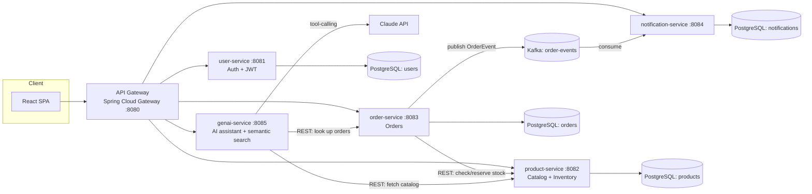

# CloudMart — Event-Driven Microservices E-Commerce Platform

CloudMart is a full-stack e-commerce platform built around independently
deployable Spring Boot microservices that communicate synchronously over
REST and asynchronously over Apache Kafka, fronted by a React SPA and a
Spring Cloud API Gateway.

It's designed to demonstrate the same patterns used in production
enterprise systems: service decomposition, event-driven communication,
JWT-based auth, containerized deployment, and CI.

## Architecture



**Why event-driven?** `order-service` doesn't call `notification-service`
directly. It publishes an `OrderEvent` to Kafka and moves on — this keeps
services decoupled, lets you add new consumers (e.g. analytics, fraud
detection) without touching `order-service`, and means a slow/down
notification pipeline never blocks checkout.

**Why does `genai-service` call the other services over REST instead of
reading their databases?** Same reason as everywhere else in this system —
each service owns its data, and `genai-service` is just another consumer of
the public API, following the exact pattern `order-service` already uses to
talk to `product-service` (timeouts + retry + circuit breaker).

## Services

| Service | Port | Responsibility |
|---|---|---|
| `api-gateway` | 8080 | Single entry point, routes `/api/**` to the right service, CORS |
| `user-service` | 8081 | Registration, login, JWT issuance, BCrypt password hashing |
| `product-service` | 8082 | Product catalog CRUD, stock reservation |
| `order-service` | 8083 | Order placement, calls `product-service` to reserve stock, publishes `OrderEvent` to Kafka |
| `notification-service` | 8084 | Kafka consumer that persists order-confirmation notifications |
| `genai-service` | 8085 | Claude-powered shopping assistant (tool-calling) + semantic product search |
| `frontend` | 3000 | React + Vite SPA: browse products, cart, checkout, order history, AI assistant |

## AI shopping assistant (`genai-service`)

A chat endpoint backed by Claude with tool-calling, plus a semantic search
endpoint that powers the main product search bar - both share one
implementation:

- **`search_products`** - instead of a vector database, the live catalog
  (small enough to fit comfortably in context) is handed to Claude along
  with the shopper's query, and Claude ranks it by relevance/intent rather
  than literal keyword match (`"something to keep coffee hot"` finds a
  thermos). This is exposed both as `GET /api/assistant/search` (used
  directly by the product search bar) and as a tool the chat assistant can
  call - one implementation, two entry points. At catalog sizes where this
  stops being practical, the natural next step is embeddings + pgvector.
- **`get_order_status` / `list_my_orders`** - the assistant can answer
  "where's my order" without the user leaving the chat. Order lookups are
  scoped server-side to the requesting user (an order that exists but
  belongs to someone else is treated as not found).
- Calls to Claude are wrapped in the same timeout/retry/circuit-breaker
  pattern used for `order-service`'s call to `product-service` - if the
  assistant is unreachable, `/api/assistant/**` degrades to a 503 instead of
  hanging or taking anything else down with it.

Requires an `ANTHROPIC_API_KEY` (see **Running locally** below). Without
one, the rest of the app works normally - only the assistant and semantic
search degrade.

## Authentication & authorization

`user-service` issues a JWT on register/login (`{ userId, role }` claims,
`role` is `CUSTOMER` or `ADMIN`). Every other service used to trust nothing
at all - `api-gateway` just proxied requests, so anyone could hit
`product-service`/`order-service`/`genai-service` directly with no token.

`api-gateway`'s `JwtAuthenticationFilter` closes that gap: it's the only
thing in the system that verifies a token. Unless a route is on the public
allowlist (`POST /api/auth/**`, `GET /api/products/**`,
`GET /api/assistant/search`), a request needs a valid `Authorization: Bearer
<token>` or the gateway rejects it with 401 before it reaches any service.
On success, it injects the verified identity as trusted headers -
`X-User-Id`, `X-User-Email`, `X-User-Role` - stripping any client-supplied
copies first so a request can't just set them itself. Downstream services
trust these headers unconditionally; they never see or verify the token.

What that buys, concretely:
- `order-service` scopes every order lookup to `X-User-Id` - `GET
  /api/orders` used to return every order in the system with no
  parameters; now it's always the caller's own orders, and `GET
  /api/orders/{id}` treats another user's order as not found rather than
  returning it.
- `genai-service`'s chat endpoint takes `userId` from the header, not the
  request body - previously a client-supplied field, so anyone could ask
  the assistant about another user's orders just by changing a number.
- `product-service` requires `X-User-Role: ADMIN` to create/update/delete
  products; browsing (`GET`) stays public. **The first account ever
  registered on a fresh system becomes ADMIN automatically** (everyone
  after that is a regular `CUSTOMER`) - there's no seed data or promotion
  flow, so register first if you want to exercise the admin-only
  endpoints.
- `docker-compose.yml` no longer publishes host ports for anything except
  `api-gateway` and `frontend` - the other services are only reachable
  from inside the compose network, so the gateway can't be bypassed
  locally either.

## Tech Stack

- **Backend:** Java 17, Spring Boot 3, Spring Data JPA, Spring Security (JWT), Spring Kafka, Spring Cloud Gateway, Resilience4j
- **AI:** Anthropic Claude (Messages API, tool-calling)
- **Frontend:** React 18, React Router, Vite
- **Messaging:** Apache Kafka
- **Data:** PostgreSQL (one schema per service — database-per-service pattern)
- **Infra:** Docker, Docker Compose, GitHub Actions CI
- **Testing:** JUnit 5, Spring Boot Test, Embedded Kafka, AssertJ, Mockito

## Running locally

### Option A — Docker Compose (recommended)

```bash
cp .env.example .env   # then fill in ANTHROPIC_API_KEY
docker compose up --build
```

This starts Zookeeper, Kafka, four PostgreSQL instances, all six backend
services, and the frontend. Once healthy:

- Frontend: http://localhost:3000
- API Gateway: http://localhost:8080

### Option B — Run services individually

Each service is a standard Maven project:

```bash
cd user-service
mvn spring-boot:run
```

You'll need PostgreSQL and Kafka running locally (or point `DB_URL` /
`KAFKA_BOOTSTRAP_SERVERS` env vars at your own instances — see each
service's `application.yml`). For `genai-service`, export `ANTHROPIC_API_KEY`
first.

For the frontend:

```bash
cd frontend
cp .env.example .env
npm install
npm run dev
```

## Example flow

1. `POST /api/auth/register` → creates a user, returns a JWT (the first
   registration on a fresh system gets `ADMIN`, everyone else `CUSTOMER`)
2. `GET /api/products` → browse the catalog (public, no token needed)
3. `POST /api/orders` with `Authorization: Bearer <token>` and
   `{ items: [{ productId, quantity }] }` - `userId` comes from the token,
   not the request body:
   - `order-service` calls `product-service` to validate stock and reserve it
   - order is persisted, total computed from live product prices
   - an `OrderEvent` is published to the `order-events` Kafka topic
4. `notification-service` consumes the event and persists a simulated
   confirmation, visible at `GET /api/notifications`

## Testing

```bash
cd order-service && mvn test    # uses spring-kafka-test's embedded broker
cd product-service && mvn test  # uses H2 in-memory DB
cd user-service && mvn test
cd notification-service && mvn test  # embedded Kafka + H2
cd genai-service && mvn test    # Claude calls are mocked - no API key needed
cd api-gateway && mvn test      # JWT filter tests use a local test secret
```

## CI/CD

`.github/workflows/ci.yml` builds and tests every backend service with
Maven and builds the frontend with Vite on every push/PR to `main`. It's
a natural extension point for adding a deploy stage (e.g. push images to
ECR, deploy to EKS/ECS).

## Possible extensions

- Replace the database-per-service Postgres instances with managed AWS RDS
- Add Eureka/Consul for service discovery instead of static URLs
- Add a `payment-service` and use Kafka choreography/saga for distributed
  transactions across order → payment → inventory
- Ship metrics to Prometheus/Grafana and traces via OpenTelemetry
- Move `genai-service`'s conversation state from in-memory to Redis so it
  survives restarts and works across replicas
- If the catalog grows past what comfortably fits in an LLM context window,
  swap the in-context ranking in `SemanticSearchService` for embeddings
  (e.g. Voyage AI, Anthropic's recommended embeddings partner) + pgvector
